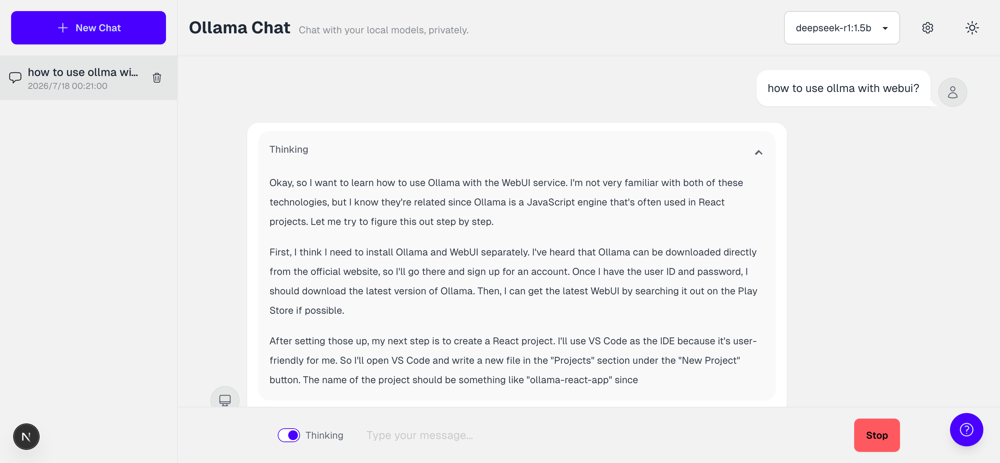

# Ollama Web UI

A modern web interface for [Ollama](https://ollama.com/) — chat with your local models, privately. Clean design, essential chat features, and no data leaving your machine.



## Features

### Chat Interface
- 🚀 Real-time streaming responses
- 🧠 Reasoning model support — displays the thinking process (e.g. DeepSeek R1) in a collapsible block, with a toggle to turn it on/off
- 💬 Multi-conversation management
- 🔄 Conversation history
- 📝 Markdown and code syntax highlighting support
- 🌓 Clean and modern UI design

### Model Management
- 📋 List available models
- 🔄 Auto-select first available model
- 🎯 Easy model switching

### Settings & Configuration
- ⚙️ Configurable Ollama server URL
- 💾 Settings persistence
- 📤 Export chat history to JSON
- 📥 Import chat history from JSON

## Getting Started

### Prerequisites
- [Ollama](https://ollama.com/) installed and running on your machine
- Node.js 20.9+ installed (for development; required by Next.js 16)
- Docker (optional, for containerized deployment)

### Installation

#### Method 1: Docker (Recommended)

1. Using Docker Compose (includes Ollama service):
```bash
wget https://raw.githubusercontent.com/oslook/ollama-webui/main/docker-compose.yml
docker compose up -d
```

2. Using Docker directly:
```bash
docker run -d -p 3000:3000 ghcr.io/oslook/ollama-webui:latest
```

#### Method 2: Development Setup

1. Clone the repository:
```bash
git clone https://github.com/oslook/ollama-webui.git
cd ollama-webui
```

2. Install dependencies:
```bash
bun install
```

3. Start the development server:
```bash
bun run dev
```

4. Open [http://localhost:3000](http://localhost:3000) in your browser

### Usage

1. Ensure your Ollama server is running (default: http://127.0.0.1:11434)
2. Select a model from the dropdown menu
3. Start chatting!

For reasoning models such as DeepSeek R1, use the **Thinking** toggle next to the
message input to show or hide the model's reasoning process. When shown, it appears
in a collapsible block above each answer.

### Configuration

- Click the settings icon (⚙️) to:
  - Configure Ollama server URL
  - Export chat history
  - Import chat history

### Deploying on the internet (CORS)

The browser talks to Ollama directly, so when this app is hosted on a public
domain the Ollama server must allow cross-origin requests. On the Ollama host set:

```bash
OLLAMA_HOST=0.0.0.0
OLLAMA_ORIGINS=*
```

then restart Ollama. Note that an HTTPS site cannot reach an `http://` Ollama URL
(mixed content) — serve Ollama over HTTPS or put it behind a reverse proxy. See the
[Ollama FAQ](https://docs.ollama.com/faq#how-can-i-allow-additional-web-origins-to-access-ollama)
for details.

## Docker Support

### Available Tags

- `latest`: Latest stable release
- `main`: Latest development build
- `vX.Y.Z`: Specific version releases

### Environment Variables

| Variable | Description | Default |
|----------|-------------|---------|
| NODE_ENV | Node environment | production |
| PORT | Port to run the server on | 3000 |

### Building Locally

```bash
# Build the image
docker build -t ollama-webui .

# Run the container
docker run -d -p 3000:3000 ollama-webui
```

### Using Docker Compose

The included `docker-compose.yml` provides two services:
1. `ollama-webui`: The web interface
2. `ollama`: The Ollama server (optional)

To use only the web interface:
```bash
docker compose up -d ollama-webui
```

To run both services:
```bash
docker compose up -d
```

## Built With

- [Next.js](https://nextjs.org/) - React Framework
- [React 19](https://react.dev/) - UI Library
- [TypeScript](https://www.typescriptlang.org/) - Type Safety
- [Tailwind CSS](https://tailwindcss.com/) - CSS Framework
- [DaisyUI](https://daisyui.com/) - UI Components
- [Zustand](https://github.com/pmndrs/zustand) - State management (persisted to localStorage)
- [react-markdown](https://github.com/remarkjs/react-markdown) - Markdown rendering

## Contributing

Feel free to submit issues and enhancement requests!

## License

This project is licensed under the MIT License - see the [LICENSE](LICENSE) file for details.

---

> **Note**: This project was generated by an AI agent and has been human-verified for functionality and best practices. The implementation combines modern web development patterns with practical user experience considerations.
